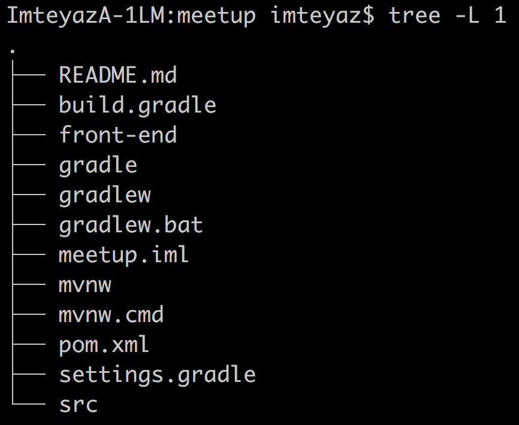

# Spring Boot and Angular 5 integration example

This repo contains codes that demonstrate how to integrate the rest api created in Spring boot.

## Project Structure

Inline-style:



```front-end``` folder contains Angular 5 codes

## Building application

The project supports both Maven and Gradle. Both are great tools. It's up to you to choose.

If you prefer Maven, you can compile the project using ```mvn clean compile```.
If you love Gradle, you can build it ```gradle clean build```.


## Front end

This project was generated with [Angular CLI](https://github.com/angular/angular-cli) version 1.6.3.

## Development server

Run `ng serve` for a dev server. Navigate to `http://localhost:4200/`. The app will automatically reload if you change any of the source files.

## Code scaffolding

Run `ng generate component component-name` to generate a new component. You can also use `ng generate directive|pipe|service|class|guard|interface|enum|module`.

## Build

Run `ng build` to build the project. The build artifacts will be stored in the `dist/` directory. Use the `-prod` flag for a production build.

## Running unit tests

Run `ng test` to execute the unit tests via [Karma](https://karma-runner.github.io).

## Running end-to-end tests

Run `ng e2e` to execute the end-to-end tests via [Protractor](http://www.protractortest.org/).

## Further help

To get more help on the Angular CLI use `ng help` or go check out the [Angular CLI README](https://github.com/angular/angular-cli/blob/master/README.md).
